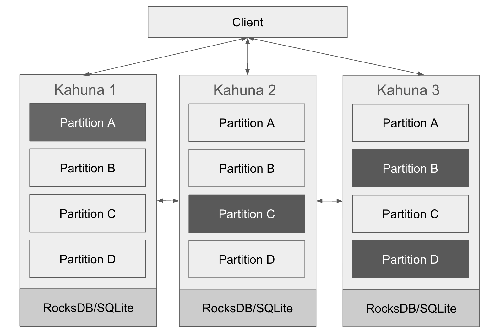

# Architecture Overview

## Distributed Storage Engine

Kahuna's architecture operates as a highly scalable, fault-tolerant distributed system that combines lock management, key-value storage, and sequencing capabilities. At its foundation lies a distributed key-value storage model where data is organized into discrete partitions similar to sharding mechanisms in other distributed systems. These partitions function as independent units that can be distributed and managed across the entire node cluster.

The system implements Multi-Version Concurrency Control (MVCC) to maintain multiple versions of data simultaneously. This versioning mechanism enables snapshot isolation for transactions, allowing the system to provide consistent read operations even while concurrent write operations are being processed on the same data. This approach eliminates read-write conflicts that would otherwise impact performance in high-concurrency environments.

## Raft-Based Consensus

Consensus across the distributed system is achieved through the Raft protocol, with each partition in Kahuna being governed by its own Raft group. This protocol ensures consistent replication of all changes across multiple nodes, thereby establishing the foundation for Kahuna's fault tolerance and high availability characteristics.

Within each Raft group, the consensus mechanism designates one node as the leader through an election process. This leader node coordinates all write operations for its assigned partition. To maintain consistency, all operations are recorded as log entries which are systematically replicated to follower nodes. This replication process ensures that data remains consistent across all nodes responsible for a particular partition.

## Transactional Model

Kahuna implements a sophisticated transaction management system that combines a two-phase commit protocol with MVCC. This transactional framework operates in distinct phases:

During the prewrite phase, locks are acquired on affected keys and tentative write operations are recorded in the system but not yet confirmed. Following successful preliminary operations, the commit phase activates, during which the system finalizes these changes across replicas to ensure atomic transaction completion.

The system supports both optimistic and pessimistic concurrency control approaches. With optimistic concurrency control, transactions operate on consistent snapshots of data while deferring conflict resolution until commit time. This approach optimizes performance in scenarios where conflicts are rare. Alternatively, when using pessimistic concurrency control, locks are acquired in advance of modifications, effectively preventing conflicts that might otherwise arise from concurrent operations on identical keys.

## Scalability and Fault Tolerance

Horizontal scalability is achieved through dynamic partition management. Partitions can be automatically split and redistributed across nodes to achieve optimal load balancing. This architecture supports linear scalability as additional nodes are integrated into the cluster, allowing Kahuna to expand its capacity proportionally with infrastructure growth.

High availability is ensured through Raft-based replication mechanisms. The system maintains operation even when individual nodes fail, as data remains accessible through replicas. Kahuna's recovery processes are designed to restore system integrity after failures without compromising committed transactions, maintaining both data consistency and service availability.

## Performance Optimizations

While Kahuna maintains strong consistency guarantees through the Raft protocol, it also incorporates various performance optimizations. Asynchronous replication techniques are employed where appropriate to enhance data replication efficiency and minimize read operation latency without sacrificing consistency requirements.

Background maintenance processes continuously perform compaction and garbage collection operations to reclaim storage space and memory resources. These automated maintenance routines help preserve system performance by systematically removing obsolete data versions that are no longer needed for transaction isolation or recovery purposes.