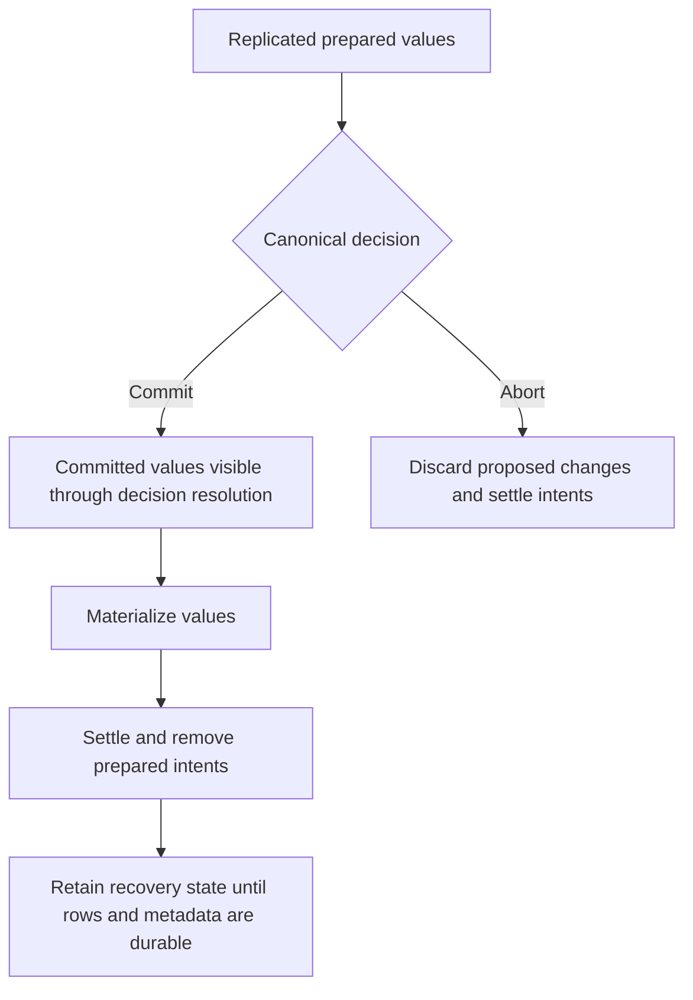

# Durable Transaction Settlement

A persistent transaction can be **committed before all of its values have been copied into the normal key/value store**. This is possible because Kahuna records the proposed values and an authoritative commit decision separately. Reads can use that decision to find committed values while the remaining work finishes.

That remaining work is called **settlement**. This page explains what it does, why it can run after commit returns, and how Kahuna preserves enough state to recover from a failure. Start with [Transaction Lifecycle](/docs/internals/transaction-lifecycle/) if transaction coordinators, participants, or preparation are new to you.

## Basic Concepts

| Term | Meaning in this page |
|---|---|
| **Participant** | A partition that holds keys modified by the transaction. A transaction can have several participants. |
| **Prepared intent** | A replicated record containing a proposed key change and its transaction identity. It preserves the value while the participant waits for the transaction's decision. Preparation alone does not mean commit. |
| **Canonical decision** | The authoritative transaction record. It changes from `Undecided` to `Commit` or `Abort`; participants follow that outcome. |
| **Materialization** | Installing a committed intent's value, deletion, or expiry change into the normal key/value projection. A projection is the state used to serve ordinary key/value operations. |
| **Settlement** | Finishing participant work from the decision and removing prepared intents. On commit, the values must be installed before their intents are removed. On abort, the proposed changes are discarded. |
| **Replica and Raft log** | A replica holds a partition's replicated state. Raft orders the records that replicas apply. A log index identifies a position in that ordered history. |
| **WAL** | Write-ahead log: stored records that can be replayed to reconstruct state. Process-loss durability requires persistent WAL storage and durable write settings. |
| **Backend flush** | Writing materialized rows to the configured storage backend. Applying a change in memory and flushing it are separate events. |
| **Commit HLC** | The transaction's commit timestamp, expressed as a Hybrid Logical Clock value. It determines historical visibility; settlement can happen later. |
| **Completion receipt** | Metadata proving that a participant already applied a committed change, useful when work is retried or recovered. |
| **PITR** | Point-in-time recovery: restoring a backup and replaying history up to a chosen time. |

There are three distinct milestones: **the transaction commits**, **its values are materialized**, and **the resulting rows are flushed**. Commit does not require waiting for every backend row to be flushed. Recovery relies on the replicated log and transaction metadata until those rows are durable.

## Walk Through a Committed Transaction

Suppose a persistent transaction changes Alice's balance from 100 to 90 and Bob's from 50 to 60. Both participants prepare their proposed values, then the coordinator establishes the canonical `Commit` decision.

| Moment | Where the new values are | What it means for the caller |
|---|---|---|
| Prepared, still `Undecided` | In replicated prepared intents. | They are proposed changes. The caller cannot treat preparation as a successful commit. |
| Canonical decision is `Commit` | They may still be in prepared intents. | The persistent transaction has committed. Reads that encounter those intents resolve the decision to determine visibility. |
| Materialized and settled | In the normal key/value projection; prepared intents have been removed. | The same committed changes can now be served without those pending intents. |
| Backend rows flushed | In durable backend rows, with the required recovery metadata persisted. | The application-durability floor can advance past the corresponding log work when all of its requirements are satisfied. |

With the default deferred settlement, the commit call can return at the second row. A read does not return Alice's old balance merely because background settlement has not finished. It resolves the committed intent, locally or through the leader holding the canonical record.

An undecided intent requires waiting or a retryable result instead of guessing its outcome. A later direct write can also produce a strictly newer committed revision that supersedes a lingering intent. See [Transaction Reads and Locks](/docs/distributed-keyvalue-store/read-and-lock-semantics/#committed-intents-and-newer-heads) for those visibility rules.



This shows the logical order. The installation and removal records differ between the default and opt-in paths described below. Backend flushing is asynchronous and may already be progressing while settlement runs.

## Choosing Settlement Behavior

Two independent choices control settlement: **when the finalizer waits for it**, and **how replicas install the values**. A finalizer is the server code driving commit or rollback to its outcome.

| Setting | Default | What it controls |
|---|---|---|
| `DurableDeferredSettlement` | `true` | Commit can return after the canonical decision is durable, while settlement runs in the background. `false` waits for settlement before returning success; it does not mean every backend row has been flushed. |
| `DurableMaterializeOnResolve` | `false` | Use separate materialization records. `true` installs values while applying the settlement record, before removing intents. |
| `DurableMaterializeByReference` | `true` | With separate materialization records, identify the prepared intent instead of copying its value bytes into another record. `false` uses value-carrying records. It has no effect when `DurableMaterializeOnResolve` is enabled. |

These settings are available on `KahunaConfiguration` and `EmbeddedKahunaOptions`. `Kahuna.Server` currently exposes none of these three settings as command-line options. They do not select a storage backend or make an in-memory embedded host survive process loss; configure persistent storage and WAL separately.

For an application using the defaults, settlement requires no client-side value replay. After a successful commit, do not rerun the business changes just because settlement is still pending. If finalization returns `MustRetry`, resolve the same transaction identity rather than assuming it rolled back. See the [outcome guidance](/docs/internals/transaction-lifecycle/#outcome-contract).

## Materialization records (default)

With `DurableMaterializeOnResolve = false`, committed participant work is installed using separate records:

1. The canonical decision establishes commit.
2. The finalizer proposes one key/value materialization record per modified key.
3. Replicas apply those records to install the committed values.
4. The finalizer submits a settlement delta to finish participant work and remove the intents.

A **delta** is a record describing changes to replicated state, rather than a complete copy of that state. If materialization fails, the intent remains available for recovery; Kahuna does not remove the only durable copy of the proposed value first.

By default, each `MaterializeIntent` record names the prepared intent instead of repeating its value bytes. Each replica obtains the value from its own prepared-intent store. This is **by-reference materialization**: the reference is to replicated transaction state, not to a value supplied later by the client.

Setting `DurableMaterializeByReference = false` produces value-carrying materialization records instead. Both encodings are supported by normal application of new log records and by WAL replay after restart. By-reference records avoid copying the value through another log entry; that entry reduction alone does not establish a latency or throughput guarantee.

For compatibility with older logs, logged key/value type `30` is also decoded as by-reference materialization. The actor-only `DropLeaderState` message is never logged, despite sharing that value in an older build. PITR reconstructs by-reference mutations from prepares in the replayed history.

## Materialization at settlement apply (opt-in)

`DurableMaterializeOnResolve = true` moves installation into the application of the settlement record. **Apply** means a replica consumes a committed log record at its position in the ordered history.

For example, these options enable that path in an embedded host:

```csharp
var options = new EmbeddedKahunaOptions
{
    DurableMaterializeOnResolve = true,
    DurableDeferredSettlement = true
};
```

This example shows only the settlement settings. Configure persistent backend and WAL options separately if the host must recover after process loss, and follow the [rolling-upgrade requirements](#rolling-upgrades) before enabling the new encoding on a cluster.

With this option enabled:

1. The canonical decision still establishes commit first.
2. No separate per-key materialization record is proposed.
3. The settlement delta carries commit-resolve commands with `MaterializeOnResolve` and the commit HLC, followed by intent removals.
4. Each replica installs values from its local prepared intents **before** applying their removals.

A **resolve command** tells a participant to finish an intent according to the transaction's decision. The finalizer and participant recovery use the same settlement builder. `DurableMaterializeByReference` has no effect on this path because there are no separate materialization records to encode.

This saves per-key materialization entries. It preserves prepare and decision work, and does not combine unrelated transactions into one atomic operation. Whether commit waits for settlement is still controlled independently by `DurableDeferredSettlement`.

### Relationship to the one-phase fast path

An eligible transaction can bundle preparation and its commit decision into a one-phase proposal. Materializing settlement remains a later operation: it is submitted only after canonical commit is established and the abort fence passes. The abort fence is the check guarding settlement against proceeding with an abort outcome.

This separation lets PITR replay materializing settlement without reconstructing the earlier one-phase decision's apply-time validation gate. A leader may install a value locally before settlement as a best-effort head start, but that local shortcut is not required for the replicated materializing settlement to proceed.

## Durability, replay and recovery

### Keeping the log until derived rows are durable

One materializing settlement record can produce several backend rows at the **same Raft log index**, plus completion receipts. Flushing one of those rows is insufficient: the others may still need the log for recovery.

The **application-durability floor** tracks which applied log work must remain available because its resulting state is not yet durable. It holds that index until **every derived row is flushed** and the required store snapshots, including receipts, are durable. Removing intents in memory alone does not permit WAL retention to advance past that work.

A settled intent whose row is still awaiting flush is retained for restart replay and included in the durable intent snapshot. This retained recovery copy is distinct from the live prepared intent that settlement removed.

### What happens after a failure or duplicate attempt

| Situation | Recovery behavior |
|---|---|
| Crash after canonical commit, before settlement | The committed prepared intents remain for the recovery sweep to install and settle. The crash does not turn the commit into an abort. |
| Rows installed, but not yet flushed | Retained settled intents and protected log history provide reconstruction state until the durability requirements are met. |
| Settlement is applied again | Live apply does not install an already removed intent again. Restart replay can reconstruct from retained settled intents while their rows are not yet durable. |
| Replica receives a whole-partition snapshot | The transfer includes intent state needed for subsequent materializing settlement. |

Settlement is **idempotent**: repeating it for the same intent does not create a new transaction or independently apply the business operation again. This does not authorize the client to repeat its transaction body with a new identity after an unknown commit result.

### Point-in-time recovery

PITR expands a materializing resolve using its replayed prepare. It filters the resulting row by the transaction's **commit HLC**, not the time settlement ran. For example, if a transaction commits before the restore target and settles afterward, settlement's later execution time does not change the committed value's logical timestamp.

A recent duplicate settlement is tolerated. If a materializing resolve has neither a replayed prepare nor recognized duplicate history, restore **fails closed**: it reports failure instead of silently omitting a committed value. See [Backups and Point-in-Time Recovery](/docs/backups-and-point-in-time-recovery/) for backup cuts and restore constraints.

## Rolling upgrades

A producer is a node writing an encoding into the log; a reader is a replica or recovery tool applying that encoding. Every reader must understand it **before any producer enables it**.

| Change | During the rollout | After every reader supports the encoding |
|---|---|---|
| Upgrade from builds without by-reference materialization support | Set `DurableMaterializeByReference = false` so producers keep writing value-carrying materialization records. | Enable by-reference materialization if desired. |
| Enable materializing settlement | Keep `DurableMaterializeOnResolve = false`. | Enable it only after all replicas and relevant replay/restore tooling support materializing resolves. |

An older node may interpret a materializing resolve as plain settlement and remove the intent **without installing its value**. That causes silent data loss on that replica. This is why enabling the producer option must come after upgrading the readers.

Turning either producer option off is safe for nodes that support both encodings; existing records remain readable. It does not rewrite log history. Once new records have been written, disabling the option does not make a downgrade to an older reader safe.

## Observing Settlement

`kahuna.kv.write.stage_entries{stage}` counts dispatched log entries by the stage that produced them. Use it to distinguish materialization entries from prepare, decision, and settlement entries.

When materialization-on-resolve is enabled, separate materialization entries can disappear while settlement entries remain. Compare this with the [write-coalescing metrics](/docs/architecture/partition-write-coalescing/#metrics); fewer entries alone are not proof of lower latency or higher throughput.

For the overall transaction flow, continue with [Transaction Lifecycle](/docs/internals/transaction-lifecycle/). For visibility while settlement is pending, use [Transaction Reads and Locks](/docs/distributed-keyvalue-store/read-and-lock-semantics/).

## Restart Replay and Missing-Value Alarms

A prepared-intent snapshot records the applied position certified before its walk and the position reflected by its end. Restart replay treats entries already represented by that slice as history: an old prepare must not become a new live key holder simply because its original competing intent has since settled.

Historical prepares are kept temporarily as value sources for later by-reference records and materializing resolves. They are invisible to reads and conflict checks; removals discard them and restore completion clears the remaining history sources. Replay looks for the named value in live intents, replay history, and retained settled intents. Before reporting a miss, it checks pending writes and backend state in newest-head order; a key that now belongs to another partition is accounted for separately.

Retained settled intents are released when the key's newest queued head is flushed, rather than just when a row with the same revision is stored. This matters when an expiry change or later mutation shares a revision: an intermediate flush must not remove the only remaining replay source while newer work for that key is still pending.

A verified unresolved by-reference materialization is a missing committed value on this replica. During live apply, the first proven absence of both the named intent and sufficient local row state triggers containment. During restart, unresolved replay results gate the partition before it can campaign. Local requests return `MustRetry`, candidacy is withheld, and snapshot reseeding is requested; installation replaces the projection and clears the gate. This detects missing reconstruction sources, not arbitrary corruption with matching revisions.

| Metric | Meaning |
|---|---|
| `kahuna.kv.materialization_intent_missing` | By-reference materialization anomalies; should remain zero. Errors include transaction, epoch, key, revision, and log index. |
| `kahuna.kv.restore_by_reference_unresolved` | Verified unresolved materializations during restart; should remain zero. |
| `kahuna.kv.restore_by_reference_resolved` | Replay resolutions by source: `live`, `history`, `retained`, or already `durable`. |

The two alarm counters are published at zero when partition restore finishes, so a healthy restore can produce an explicit zero series. Partitions that replayed materializations emit a Warning-level summary even when clean. An unresolved summary includes the count, distinct keys, and log-index range. Investigate nonzero alarms and the associated containment/reseed messages; a Warning summary with zero unresolved records is not itself evidence of data loss.
