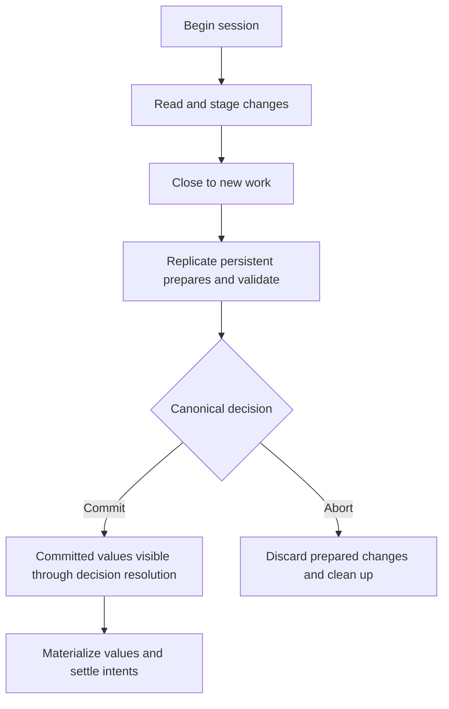

# Transaction Lifecycle

A transaction groups several key/value operations into one attempt to commit or roll back. In Kahuna, those keys can belong to different partitions and be served by different nodes. The transaction coordinator tracks the work and coordinates the outcome.

This page starts with the vocabulary and a worked example, then follows the implementation in more detail. You do not need prior knowledge of Raft, MVCC, or two-phase commit. If you want to write an application first, start with [Transactions](/docs/distributed-keyvalue-store/transactions/) and the [.NET](/docs/dotnet-client/) or [TypeScript](/docs/typescript-client/) client examples.

The main distinction to keep in mind is **staged, prepared, and committed**. A successful write inside an open transaction is staged work, not a committed change. Persistent prepare makes that proposed work recoverable. The canonical commit decision determines whether it becomes visible; copying it into the normal backend can happen later.

## Basic Concepts

| Term | Meaning in this page |
|---|---|
| **Node** | A running Kahuna server or embedded host. |
| **Partition** | A group of keys with its own replication and ordering. A transaction can involve several partitions. |
| **Leader and replica** | A partition's leader coordinates its persistent writes. Other hosting nodes hold replicas of that partition's replicated state. |
| **Coordinator** | The server component that owns the transaction session, tracks completed operations, and drives commit or rollback. It can be on a different node from the keys. |
| **Participant** | A partition that executes work for the transaction. Modified persistent participants must prepare their changes before the coordinator decides commit. |
| **Transaction handle** | The identity the client uses for later operations and finalization. It routes the live session back to its original coordinator node. |
| **Working set** | The coordinator's record of confirmed reads, modified keys, and acquired locks. Commit uses this record. |
| **MVCC** | Multi-version concurrency control: keep proposed transaction values separate from committed values, and retain history for historical reads. |
| **Write intent** | State identifying a transaction that intends to change a key. An unprepared intent is leader-local; a persistent prepared intent is replicated and includes the proposed value. |
| **Revision and write base** | A revision is a per-key version number. A write base is the committed revision a proposed change was derived from. |
| **Read dependency** | A value or absence the transaction observed and depends on. Validation checks whether competing work invalidated that observation. |
| **Lock and lease** | A transaction lock excludes conflicting operations while held. A lease limits how long ownership lasts without renewal. These locks are leader-local, and renewal can leave gaps. |
| **Validation** | Checking whether the observations and write bases used by the transaction are still acceptable. A concurrent change can cause an abort. |
| **Raft and quorum** | Raft orders replicated entries for a partition. A quorum is the required majority of that partition's voters; writing on one node alone is insufficient for persistent commit. |
| **WAL** | Write-ahead log: the ordered records used to reconstruct replicated state after failure. Process-loss durability requires a persistent WAL and durable write settings. |
| **HLC** | Hybrid Logical Clock: a timestamp containing physical time and logical ordering information. Transaction identity, commit time, and an explicitly requested historical read time have different roles. |
| **Canonical decision** | The authoritative transaction record, which moves from `Undecided` to `Commit` or `Abort`. Participants resolve their prepared work from it. |
| **Materialization and settlement** | Materialization installs committed values into the normal key/value projection. Settlement finishes participant work and removes prepared intents. |

An **actor** is a local worker that processes one message at a time and owns mutable state for its keys. Actors provide local serialization; Raft provides replicated ordering. An actor and a Raft partition are different units, so one actor can handle keys from several partitions.

## Walk Through a Persistent Transaction

Suppose an application transfers 10 units from Alice to Bob. For this example, the accounts are persistent, Alice starts with 100, Bob starts with 50, and the keys are on different partitions. The application checks that Alice has enough funds and stages the two new balances.

| Step | What happens | What it means |
|---|---|---|
| 1. Begin | Kahuna admits the transaction and creates its identity and coordinator session. | The client receives a handle for this attempt. |
| 2. Read | Participants return Alice's 100 and Bob's 50. | Latest transactional reads record committed observations per key. They are not automatically a shared transaction-start snapshot. |
| 3. Stage | The application writes Alice = 90 and Bob = 60 inside the transaction. | Its own later reads can see these values. Other transactions cannot treat these uncommitted writes as committed balances. |
| 4. Close | The client calls commit. The coordinator stops accepting new work, waits for registered operations, and freezes the working set. | The attempt cannot accept another write while commit is being retried. |
| 5. Prepare and validate | The persistent participants replicate the proposed values as prepared intents. The coordinator checks staged bases and read dependencies. | The proposed values can now survive participant failover, but prepare alone does not mean commit. |
| 6. Decide | If prepare and validation pass, the coordinator establishes the canonical `Commit` decision. Otherwise it establishes or follows `Abort`. | This record decides the persistent transaction's outcome. |
| 7. Settle | Committed values are materialized and prepared intents are removed. | By default, commit can return before this work finishes. Reads resolve remaining intents from the decision. |



This diagram shows the usual persistent path. The client can receive a retryable result between steps without knowing which decision won. Some eligible single-partition transactions combine prepare and decision into one Raft proposal, as described later.

If another transaction changes an observed account, a later point operation or final validation can abort this attempt. After a definite abort, start a new transaction and read both balances again. If commit returns `MustRetry`, resolve that same attempt first: blindly repeating the transfer in a new transaction could apply it twice.

Persistent writes share the canonical outcome, but reading several keys one by one does not by itself provide a fixed snapshot. For exact read and lock rules, see [Transaction Reads and Locks](/docs/distributed-keyvalue-store/read-and-lock-semantics/).

## Outcome Contract

The first question after a failed request is whether Kahuna established a final outcome. Use the result to choose the next action:

| Outcome | Meaning | What the caller should do |
|---|---|---|
| `Committed` | The canonical persistent decision is commit, or the in-memory commit completed. | Treat the attempt as successful. Do not repeat its business changes. |
| `RolledBack` | Mandatory rollback cleanup was acknowledged. | The attempt is finished. Start a new transaction if needed. |
| `Aborted` | A definite non-committing outcome, including conflict, lost staging, or confirmed presumed abort. | If retrying the business operation, start a new transaction and recompute from new reads. |
| `MustRetry` | The outcome is uncertain or transient work remains. | Retry the same finalization with the same handle; do not add new operations or assume rollback. |
| `Errored` | The handle is unknown, expired, or its outcome is unavailable. | Resolve the uncertainty at the application boundary; this result alone does not prove rollback. |

`Aborted` is terminal and can include stale validation, lost staging, and a confirmed deadline/presumed abort. Admission rejection surfaces as `AdmissionRefused` before a transaction starts. Infrastructure failures and unresolved finalization return `MustRetry` when the outcome cannot yet be established; retry with the same identity.

## Transaction Shapes

Kahuna has two transaction shapes:

| Shape | Driven by | Entry point | Transport |
|---|---|---|---|
| Script transaction | The server runs a submitted script | `TryExecuteTransactionScript` | REST, gRPC, embedded |
| Interactive transaction | The client sends operations one by one | `StartTransaction`, operations, `CommitTransaction` | gRPC and embedded |

Both shapes converge on the same coordinator machinery. A script builds the working set while the script executor runs statements on the server. An interactive session builds the working set across several client round trips.

A bare multi-statement script is treated as one auto-commit transaction. A single-command script can be optimized into the direct command path and does not need the full transaction coordinator.

## Entry and Routing

Routing answers two questions: which partition owns the key, and which node currently leads that partition? The request then reaches the local worker that owns the key's mutable state. In code, the path is:

```text
REST / gRPC / embedded
  -> IKahuna
  -> KahunaManager
  -> KeyValuesManager
  -> partition routing
  -> actor routing
```

`KeyValuesManager` first resolves the key space and data partition. The partition leader is the only node allowed to commit durable state for that partition. If the receiving node is not the leader, the request is forwarded over inter-node communication.

After leader routing, a consistent-hash actor router selects the local `KeyValueActor` shard that owns the key, bucket, or range state. Actors process one message at a time, so the mutable entry, lock, proposal, and MVCC maps do not need broad shared locking.

## Priority Admission

Admission limits how many transactions may start at once; it does not decide whether their changes commit. Transaction priority admission sits after coordinator-leader routing and before the transaction ID is created. That ordering matters: a queued transaction should receive the HLC timestamp of when it actually starts, not a timestamp from before it waited.

The gate is per node and in memory. It has separate orderers for script transactions and interactive sessions, because scripts hold a slot for bounded server execution while sessions hold a slot for as long as the client keeps the session open.

When a ceiling is disabled, admission is pass-through and only records priority metrics. When a ceiling is enabled, the orderer either grants a slot immediately or parks the caller in a priority queue. Slot release happens when a script transaction exits or when an interactive session is finalized, reaped, or otherwise retired.

Aging raises the scheduling priority of a transaction that has waited, helping it move forward in the ordinary queue. Slots reserved for `High` and `Critical` still require that original priority; waiting does not make a `Background` transaction eligible for a reserved slot.

If the wait queue is full or the caller's admission wait expires before starting, admission returns `AdmissionRefused`. No transaction has started, so retrying is safe, but clients should back off because the node is shedding load.

## Separate Keyspaces

Choose durability for each operation. It determines where that key's state lives and what can survive failure:

| Durability | Storage | Transaction implication |
|---|---|---|
| Ephemeral | In memory only | Allowed under BestEffort; explicit `DecisionDurability.Durable` rejects ephemeral modified keys |
| Persistent | Raft plus materialized backend | Eligible for durable-intent two-phase commit |

The ephemeral and persistent keyspaces have separate actor routers. A key named `session/1` in ephemeral storage is not the same object as `session/1` in persistent storage. This separation is important under deferred settlement because persistent prepared intents must never be visible to ephemeral reads or writes for a same-named key.

## Staging Before Commit

Staging keeps a proposed write separate from the committed value while the application is still working. A successful transactional `SET` means the operation was accepted into this attempt; it does not mean the transaction committed. The owning `KeyValueActor` stages:

- an MVCC entry for the transaction ID, containing the proposed value, revision, expiry, and state
- a write intent with a short lease, so other transactions can detect an in-progress writer

Pessimistic transactions acquire locks before or during operations to reduce competing work. Optimistic transactions read without exclusive locks and rely on conflict checks. A point lock protects a key; prefix and range locks protect groups of keys and help guard against new keys appearing in a scanned group. They are leader-local, so failover can remove them and validation remains necessary.

Reads inside the same transaction can see their own staged MVCC entries. A first latest transactional point read pins its committed value or absence per key; later operations and finalization use those observations for conflict checks. Snapshot reads are different: they read at a fixed historical HLC timestamp and do not create latest-state dependencies.

Non-transactional persistent writes skip transaction staging and go directly through the partition write aggregator.

## Staging Continuity and Read Observations

Latest transactional reads pin committed observations per key, including committed unsettled intents. `SET` and `DELETE` advance staged revisions; `EXTEND` changes expiry without advancing the revision. Before granting a point lock, Kahuna resolves committed predecessor work so the grant observes the correct committed base. That base becomes a coordinator read dependency. These checks still apply after failover.

Leadership loss clears actor-local staging and locks, but the active session stays on its original coordinator node. Before durable finalization, the coordinator verifies the confirmed staged revision chain and reads of staged values. A broken chain terminates with `Aborted` and a `Lost staging: …` reason, rather than committing an incomplete write set. Process loss can lose the session entirely. Metrics include `kahuna.kv.staged_chain_breaks` and `kahuna.kv.staged_chain_break_aborts`.

See [Transaction Reads and Locks](/docs/distributed-keyvalue-store/read-and-lock-semantics/) and [Durable Settlement](/docs/internals/durable-settlement/) for visibility, settlement encodings, durability floors, and upgrade requirements.

## Server-Owned Working Set

The working set is the coordinator's record of what actually succeeded. For example, a successful write to Alice enters the modified-key list; a failed conditional write does not. Clients carry a transaction handle, but they do not provide the final list of keys to commit.

As operations complete, the coordinator records:

- modified keys and durability
- point, prefix, and range locks still held
- latest-read observations and validation policy
- transaction-wide snapshot timestamp policy
- registered operation IDs, pending operations, and completed operation responses
- timeout, locking mode, decision durability, lifecycle, and finalization state
- the durable record anchor, once a persistent modified key establishes one

Only confirmed effects are folded into this state. Failed conditional writes and failed lock acquisitions do not become modified keys or held locks.

## Operation Registration

A lost response does not necessarily mean an operation failed. Interactive operations therefore use a stable operation ID and a digest (a fingerprint of the request inputs), so the same request can be recognized when retried. Registration and the finalization fence share the same critical section:

```text
BeginOperation
  -> participant execution
  -> CompleteOperation with confirmed effects
  -> fold effects into TransactionContext
```

This closes two failure windows. A duplicate operation ID with the same declaration can replay the original response. The same ID with different inputs is rejected. If finalization has already closed the session, new operations cannot slip into the frozen working set.

Participants also keep a bounded in-doubt result cache. If a participant applied a mutation but the completion acknowledgement to the coordinator was lost, a retry with the same operation ID can replay completion without applying the mutation twice. This cache is a short retry aid, not durable history.

## Finalization Fence

Finalization means finishing the attempt through commit or rollback and cleanup. Its fence closes the session to new work, so a late write cannot be omitted from a commit that is already running. Commit, rollback, close, and abandoned-session cleanup share one finalization slot per session.

Finalization proceeds in this order:

1. Close the session to new operations.
2. Drain operations registered before the fence.
3. Freeze an immutable copy of the server-owned working set.
4. Run commit or rollback from that snapshot.
5. Perform required cleanup.
6. Publish the same outcome to the owner and any concurrent callers.
7. Retain the terminal outcome before removing the active session.

A retryable finalization failure releases the attempt slot, but it does not reopen the session to new reads or writes. The caller should retry commit or rollback with the same handle.

## Commit Paths

`TransactionCoordinator.TwoPhaseCommit` splits the frozen working set by durability:

| Working set | Commit path |
|---|---|
| Read-only | Commit succeeds without prepare |
| All ephemeral | In-memory prepare and commit |
| All persistent | Durable-intent two-phase commit |
| Mixed under BestEffort | Ephemeral subset prepares first, then persistent durable finalization drives ephemeral commit or rollback; the ephemeral subset can be lost on process failure |

`DecisionDurability` is the session policy. Its default, BestEffort, allows ephemeral work; the name does not mean persistent writes skip durable preparation. Persistent modifications use durable-intent finalization under either decision policy. BestEffort allows mixed work, but does not make the ephemeral subset survive process loss. Explicit Durable mode rejects ephemeral modified keys. The active session itself remains in memory.

## Durable-Intent Two-Phase Commit

Two-phase commit separates **prepare** (preserve the proposed changes) from **decide** (choose commit or abort). It prevents a participant from treating its successful prepare as permission to commit independently. The persistent implementation uses two replicated stores:

| Store | Scope | Role |
|---|---|---|
| `TransactionRecordStore` | Anchor key partition | Canonical record keyed by `(TransactionId, Epoch)`. It moves once from `Undecided` to `Commit` or `Abort`. |
| `PreparedIntentStore` | Modified key partition | One live intent per modified key, carrying the proposed value until its decision is resolved. |

The first confirmed persistent modified key becomes the record anchor: the key used to locate the partition holding the authoritative decision. The transaction record is internal metadata, not a new user key/value record. A participant manifest lists the participants; its hash identifies the frozen finalize input. The transaction epoch is part of the internal record identity.

The durable finalizer runs this sequence:

1. Build an immutable finalize input with transaction identity, manifest hash, record anchor, commit timestamp, decision deadline, participant manifest, and exact prepared intents.
2. Initialize the canonical record as `Undecided` and prepare the anchor partition's intents in one atomic ordered proposal when the anchor is also a participant.
3. Prepare every other participant partition concurrently.
4. Retry a prepare in place when it is blocked only by a predecessor's committed-but-unsettled intent.
5. Validate staged bases and the read set after every prepare is durable.
6. Confirm staged-base fence verdicts from prepared replicas before committing.
7. Atomically change the canonical record from `Undecided` to `Commit` only when every prepare succeeded and validation passed. Otherwise attempt the same conditional change to `Abort`.
8. Resolve prepared intents from the record outcome.

The decision record is the point of no return. Once it commits as `Commit`, Kahuna must not later report a definite abort for that transaction. If a concurrent recovery pass wins the record as `Abort`, the finalizer reports the record's actual outcome, not the outcome it hoped to write.

A write's base is the committed revision from which it was derived. A lost update would occur if a transaction overwrote a competing change using that outdated base. Validated-base writes get a second check after prepare. The leader checks the current committed base before prepare, each replica remembers the committed head it saw while applying the prepare, and the finalizer asks replicas for those verdicts before writing `Commit`. A `StaleBase` verdict aborts the transaction as a conflict. Missing or unreachable verdicts are counted as unattested and do not by themselves block commit; the canonical decision still follows the ordered record path.

The replica fence has a per-endpoint lag breaker. If a replica repeatedly cannot attest within the apply wait, for example during a disk pause, WAL saturation, or snapshot install, Kahuna keeps asking it for instant verdicts but stops waiting for its apply path on every commit. When this node leads the participant partition, the breaker also reads Raft follower progress: a replica whose durable frontier is too far behind, or whose WAL is stalled, is treated as lagging immediately and is not restored until it both attests and its frontier is back within the bound. Operators can watch `kahuna.durable_tx.replica_fence_lag_transitions{state,reason}`, `kahuna.durable_tx.replica_fence_lagging_replicas`, `kahuna.durable_tx.replica_fence_lagging_asks{kind}`, `kahuna.durable_tx.replica_fence_unattested`, and `kahuna.durable_tx.finalize_replica_fence_ms`.

## Decision Deadlines

The decision deadline limits how long an undecided transaction can block recovery. It is separate from the timeout for the entire interactive session. Each durable finalize freezes this deadline:

```text
commit timestamp + clamp(multiplier x observed finalize p99, floor, ceiling)
```

The p99 is the estimated duration below which 99% of locally observed finalizations fall. `clamp` keeps the computed margin between configured minimum and maximum values. It gives healthy coordinators enough time to finish under current load, while bounding how long recovery waits before presuming an undecided transaction was abandoned.

A late commit attempt does not force the record to `Commit`; finalization or recovery drives presumed abort and follows the canonical decision that wins the race. A rising `kahuna.durable_tx.late_commit_rejections` or `kahuna.durable_tx.deadline_expiry_aborts` rate usually means the deadline margin is too tight for current latency.

## Aggregator Role

The write aggregator is a per-partition batching step before Raft. Durable record, prepared-intent, materialization, and settlement records enter Raft through it. This lets concurrent durable transactions targeting the same partition share one `ReplicateEntries` call.

Aggregator submissions have an admission class:

| Class | Used for | Purpose |
|---|---|---|
| Ordinary | Direct persistent writes, record init, prepare | Normal partition write admission |
| Terminal | Decision, materialize, settle, recovery, metadata handoff | Reserved headroom so ordinary-write bursts cannot starve already-prepared transactions |

The anchor partition can submit `[TransactionRecord init, PreparedIntent prepare]` as one ordered bundle. A batch can mix direct key/value records and durable transaction records, but every submission keeps its own completion path.

Durable transaction stores are written only by the ordered Raft apply stream. Proposal completion waits for the ordered apply result for its log index, then resolves the finalizer. If this node loses leadership before that local apply result arrives, or the wait exceeds the proposal timeout, the completion is released as unobserved and the coordinator retries through the current leader. The relevant counters are `kahuna.durable_tx.ordered_apply_waits_released_on_leadership_loss`, `kahuna.durable_tx.ordered_apply_wait_timeouts`, and `kahuna.durable_tx.redundant_applies_skipped`.

## One-Phase Durable Fast Path

When a durable transaction's full participant set is the anchor partition, Kahuna can collapse record initialization, prepare, read validation, and commit decision into one Raft proposal. That removes the usual two durable barriers for single-partition transactions while keeping the decision replicated.

If another node leads the anchor partition, the coordinator forwards the whole one-phase bundle as a typed durable operation. The receiving leader submits the record, prepared intent, and decision entries as one atomic scheduler submission under the original range fence. If the remote leader is too old to understand that typed operation, the coordinator falls back to the standard two-phase flow instead of approximating the result.

With `OnePhaseApplyTimeValidation` enabled, replicas also check same-partition point-read dependencies and validated write bases at apply time against the committed-head ledger. That keeps read-modify-write transactions eligible for the fast path in a multi-node group. Predicate dependencies, such as prefix or range locks, and off-partition read dependencies still use two-phase commit.

The main metric is `kahuna.durable_tx.one_phase_gate{outcome}`:

| Outcome | Meaning |
|---------|---------|
| `entered` | The transaction was eligible for a one-phase attempt. |
| `read_set_beyond_writes` or `validated_base` | Apply-time validation is off, so the bundle cannot safely carry that dependency in a multi-process group. |
| `predicate_read` | A prefix or range dependency requires the two-phase path. |
| `off_partition_read` | A read dependency routes to a different partition than the anchor. Co-locate related hash key spaces with a placement group when the workload should stay single-partition. |
| `non_persistent_read` | The dependency has no persistent committed-head ledger entry. |
| `multi_partition` or `anchor_off_partition` | The write set cannot be represented by one anchor-partition bundle. |

Related counters and histograms include `kahuna.durable_tx.one_phase_commits`, `kahuna.durable_tx.one_phase_fallbacks`, `kahuna.durable_tx.one_phase_bundle_ms`, and `kahuna.durable_tx.one_phase_pre_bundle_ms`. Use them together: a high gate-entered count with low commits means the workload looks eligible at first but is falling back before the bundle commits.

## Deferred Settlement

Commit answers “did the transaction commit?” Settlement finishes installing and cleaning up that committed work. They are separate events. `DurableDeferredSettlement` defaults to `true`. With the default:

1. The finalizer returns `Committed` as soon as the canonical decision record is durable.
2. Materialization and intent settlement run on a background task.
3. Recovery finishes settlement if that background task is lost.

This moves settlement off the commit critical path. Until settlement finishes, a committed value may still live in a prepared intent whose local resolution is `Pending`. Failure or overload can prolong this interval; a pending intent does not imply the canonical decision is still undecided.

Kahuna handles that window through intent-aware visibility:

| Operation | Behavior in the deferred window |
|---|---|
| Point read or exists | Resolves the canonical decision; a strictly newer committed head supersedes a lingering intent, including newer tombstones/expired values |
| Bucket, prefix, or range scan | Overlays visible prepared intents, honoring strictly newer heads and resolving foreign decisions when needed |
| New write | Materializes a committed predecessor intent before deriving revision, existence, and conditional checks |
| New transaction prepare | Waits or retries while a predecessor still owns the live intent |

When the canonical record is not local, the read or write path can route a lookup to the anchor-partition leader and retry with the terminal decision. It does not serve the stale pre-transaction value just because settlement has not materialized yet.

Setting `DurableDeferredSettlement` to `false` restores synchronous settlement: the finalizer waits for materialization and settlement before returning success.

By default, durable materialization writes `MaterializeIntent` records. These records carry the intent identity, revision, state, and commit timestamp, but not the value bytes. Each replica resolves the value from the prepared intent it already holds, which avoids sending and storing the same committed value through Raft a second time. Use by-value materialization only during mixed-version upgrades from builds that cannot apply `MaterializeIntent`.

## One-Phase Apply-Time Validation

The fast path above needs the same conflict checks as two-phase commit. Apply-time validation means replicas check the bundled operation when it reaches its position in the committed log, rather than relying only on checks made before submission. The committed-head ledger records the heads used to judge those dependencies.

`OnePhaseApplyTimeValidation` extends that fast path to read-modify-write and read-carrying durable transactions in multi-process Raft groups. The bundled commit carries its written keys, validated bases, and same-partition point-read dependencies. Each replica judges the bundle at apply time, in log order, against the committed-head ledger. If another committed write moved a base or read dependency before the bundle applies, the bundled commit is rejected rather than committing a lost update.

The option is off by default. Enable it only after every node in the group runs a version that persists the committed-head ledger and applies the extended gate. While it is enabled, `StagedBaseFenceRetentionMs` must match across the group because that horizon controls how long the ledger can prove a base or read has not moved.

## Recovery

Recovery finishes durable work when the original finalizer cannot, for example after a coordinator crash or participant leader change. It reads the authoritative decision rather than treating a missing response as an abort. `PreparedIntentRecoveryActor` periodically drives `DurableTransactionRecovery` for partitions the node currently leads.

For each unresolved intent whose recovery deadline is due:

- record says `Commit`: materialize the value and settle the intent
- record says `Abort`: discard and settle the intent
- record is `Undecided` inside its deadline: leave it for the live coordinator
- record is `Undecided` after its deadline, or missing within the protected canonical-record retention horizon: drive an idempotent presumed abort, then resolve from the record that actually won

Recovery and request-path finalization can run concurrently. Initialize, prepare, decide, materialize, and settle are idempotent: repeating them for the same identity does not create a second independent transaction or reverse a terminal decision. Recovery never guesses a terminal decision while the canonical record is still undecided inside its deadline.

## Missing Canonical Records Beyond Retention

A missing canonical record is not always proof of abort. Beyond the protected outcome-retention horizon, recovery requires a matching completion receipt as commit proof. Without one it holds the intent instead of guessing that a reclaimed record means abort. The horizon uses `DurableRecordRetentionFloor` when retention budgets are enabled; the floor is raised to at least the decision-deadline ceiling plus two maintenance intervals. Undecided records and unresolved intents are not evicted to admit new work.

## Completion Receipts and Range Movement

A completion receipt is evidence that a participant already applied a committed change. When a committed intent materializes, Kahuna records this receipt with the key/value commit. A duplicate commit or recovery re-drive can use the receipt to prove that the participant already applied the transaction after the original MVCC state is gone.

The receipt identity includes transaction, key, and durability, so a persistent receipt cannot satisfy an ephemeral operation for the same logical key.

Range split and merge transfer durable transaction records, prepared intents, and completion receipts to the destination partition before cutover. The transfer is replicated on the destination partition's Raft log and gates cutover. Range-lock transfer is separate and best-effort because range locks are in-memory leader state.

## WAL and Persistence

The Raft WAL records the ordered changes used for recovery. The backend holds the materialized key/value rows used for normal storage and reads. These are separate layers; a commit need not wait for the backend to flush every row. The usual persistent sequence is:

1. The partition leader proposes an ordered batch.
2. A quorum persists it.
3. The committed entries apply to the in-memory state machines.
4. The background writer later flushes materialized state to RocksDB, SQLite, or memory.

Backend persistence is not the commit point. It is the materialized store that lets a node avoid replaying every log forever and serve evicted persistent entries after reload.

These storage optimizations affect how WAL writes are grouped and acknowledged:

- Group commit can coalesce several partitions into one storage flush.
- Single-fsync commit can acknowledge an auto-commit proposal after the propose quorum is durable and write the committed marker lazily.

## Bounds and Backpressure

Bounds limit memory and queued work. Backpressure means refusing or delaying new work when those limits are reached, rather than admitting unlimited requests. Application authors should keep transactions short and handle admission/retry responses; operators can use these settings to diagnose capacity pressure.

Important transaction bounds:

| Setting or limit | Purpose |
|---|---|
| `DurableDecisionOutstandingMax` | Hard cap on outstanding undecided canonical records admitted by a node |
| `DurableRecordRetentionMax` | Count budget for retained terminal durable records |
| `DurableRecordRetentionMaxBytes` | Estimated heap-byte budget for terminal durable records plus completion receipts |
| `DurableRecordRetentionHeapPressure` | Last-resort heap pressure threshold for reclaiming old terminal records |
| `DurableRecordRetentionFloor` | Minimum terminal-record age protected from early budget reclamation |
| `DurableMaintenanceInterval` | Tick interval for prepared-intent recovery and durable retention sweeps |
| `DurablePreparedIntentMaxCount` | Resident prepared-intent count bound |
| `DurablePreparedIntentMaxBytes` | Resident prepared-intent value-byte bound |
| `DurableMaterializeOnResolve` | Installs values from local prepared intents during settlement apply; enable only after all readers support it. See [Durable Settlement](/docs/internals/durable-settlement/). |
| `DurableMaterializeByReference` | Enables value-free committed-intent materialization |
| `SessionOwnedIntentCeilingMs` | Maximum age for orphaned session-owned write intents and no-expiry range locks |
| `OnePhaseApplyTimeValidation` | Allows eligible bundled durable commits to validate reads and bases at apply time |
| `TransactionOutcomeRetentionMax` | Retained terminal outcome count for duplicate finalize idempotency |
| `TransactionOutcomeRetentionTtl` | Retained terminal outcome age window |
| `MaxTransactionTimeout` | Upper bound for admitted interactive session lifetime |
| `MaxConcurrentTransactions` | Script transaction concurrency ceiling. `0` disables the script gate |
| `MaxConcurrentSessions` | Interactive session concurrency ceiling. `0` disables the session gate |
| `TransactionPriorityReservedSlots` | Slots reserved for `High` and `Critical` work |
| `TransactionPriorityAgingThreshold` | Wait time per effective priority promotion |
| `TransactionPriorityMaxQueued` | Waiters allowed per gate before admission returns `AdmissionRefused` |
| `DefaultAdmissionWaitMs` | Admission wait used when the caller does not specify one |
| `MaxAdmissionWaitMs` | Maximum admission wait allowed by the server |
| Pending operations per session | In-flight operation bound |
| Total operations per session | Retained operation-record bound |

Important aggregator bounds:

| Setting or limit | Purpose |
|---|---|
| `KeyValueWriteMaxBatchItems` / `KeyValueWriteMaxBatchBytes` | Submissions and payload selected for one partition Raft call; one bundle can contain multiple entries |
| `KeyValueWriteMaxQueuedItemsPerPartition` / `KeyValueWriteMaxQueuedBytesPerPartition` | Per-partition admitted work |
| `KeyValueWriteMaxQueuedItemsGlobal` / `KeyValueWriteMaxQueuedBytesGlobal` | Node-wide ordinary admitted work |
| `KeyValueWriteTerminalReserveItemsPerPartition` / `KeyValueWriteTerminalReserveBytesPerPartition` | Per-partition terminal reserve |
| `KeyValueWriteTerminalReserveItemsGlobal` / `KeyValueWriteTerminalReserveBytesGlobal` | Node-wide terminal reserve |
| `KeyValueWriteMaxOperationBytes` | Hard ceiling for one admitted serialized write |
| `KeyValueWriteBatchExecutionTimeoutMs` | Maximum Raft round-trip time for one aggregator batch |

## Where to Go Next

For application development, use [Transactions](/docs/distributed-keyvalue-store/transactions/) for API examples and [Transaction Reads and Locks](/docs/distributed-keyvalue-store/read-and-lock-semantics/) for read visibility and lock behavior. For operations or implementation work, continue with [Durable Settlement](/docs/internals/durable-settlement/), [WAL and Persistence](/docs/internals/wal-and-persistence/), and [Snapshot Installation and Raft Recovery](/docs/snapshot-and-raft-recovery/).

## Leadership Proof for Transaction Locks

A successful lock grant reports its partition and Raft term (the leadership epoch). The coordinator retains the first term per partition. A grant or renewal under a different term marks lost exclusion, and commit checks leadership continuity even for a read-only transaction. A changed term, moved range, or unconfirmed proof returns terminal `Aborted` with `Lost lock: …`. Reacquiring the lock does not repair a computation based on earlier reads.

The proof does not detect lease expiry within an unchanged term, and older nodes without term reporting leave their grants unchecked. One-phase bundles with apply-time validation also check the grant term against the proposal term. See [Detecting Locks Lost During Failover](/docs/distributed-keyvalue-store/read-and-lock-semantics/#detecting-locks-lost-during-failover) for an example, rollout limits, and metrics.
